# v2ray-glitch

在Glitch中部署v2ray服务

### 请勿重度使用！！！

### 请勿重度使用！！！

### 请勿重度使用！！！

官网: https://glitch.com/

## 部署步骤: New Project -> Import form Github -> 将本项目网址粘贴进去 "https://github.com/ALLOC20/v2ray-glitch"

### 1. New Project

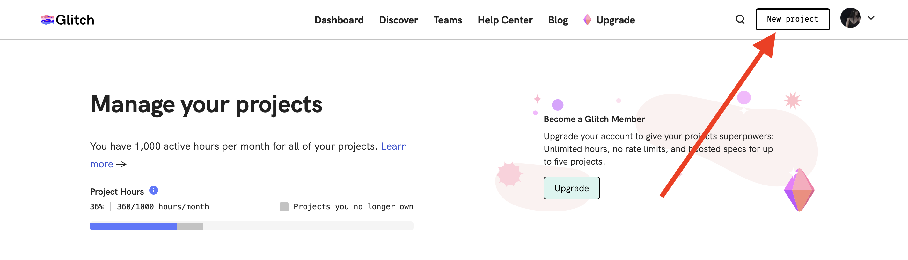

### 2. Import form Github

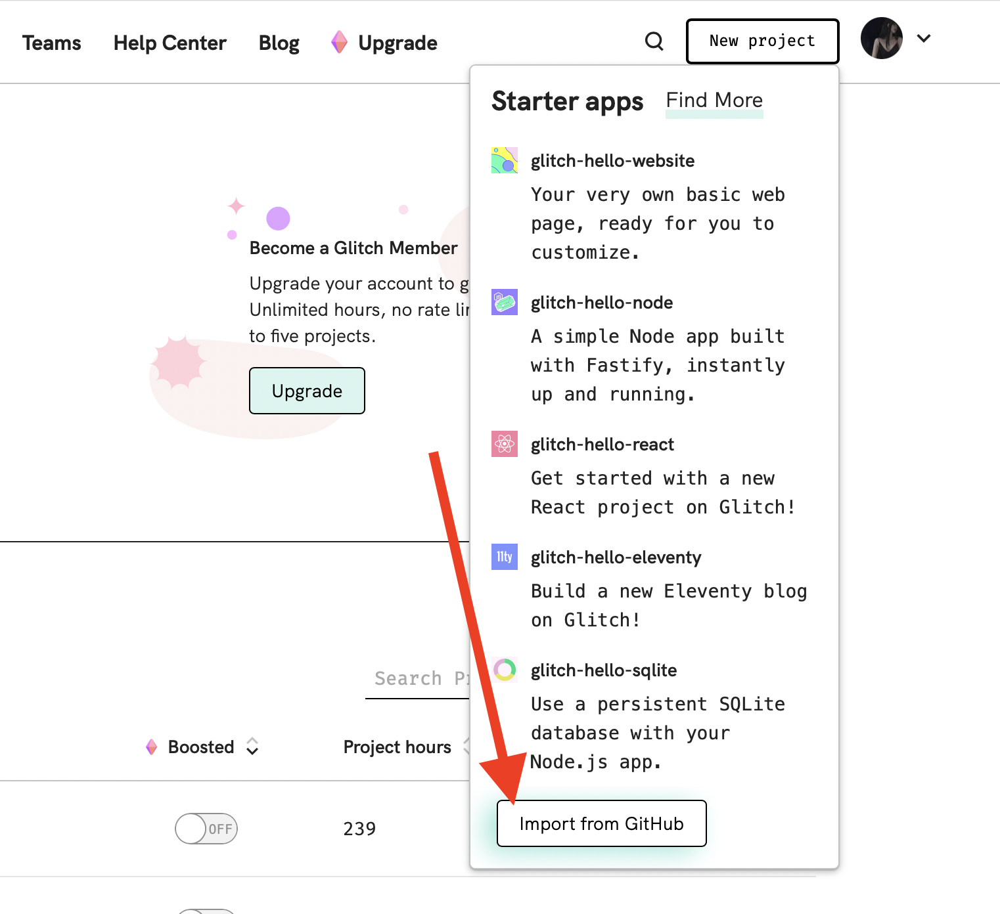

### 3. 粘贴本项目网址

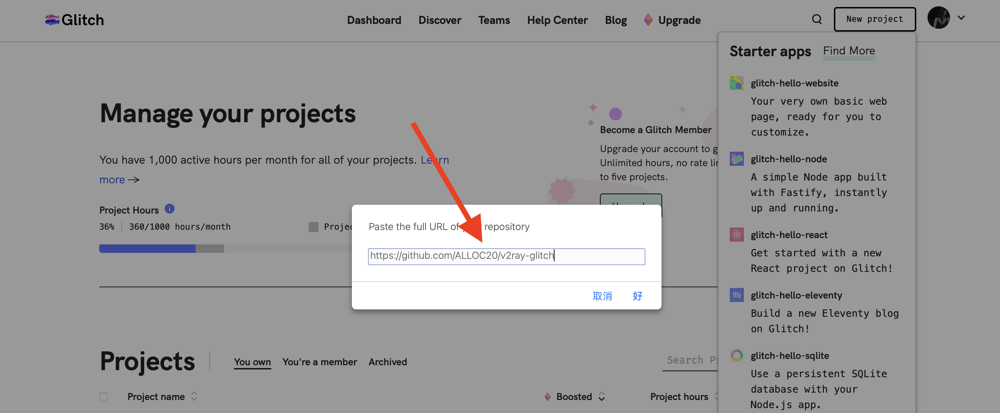

## 必要调整: 改应用名称 -> 生成UUID并填入代码中 -> 是否保持唤醒 -> 刷新

### 1. 改应用名称

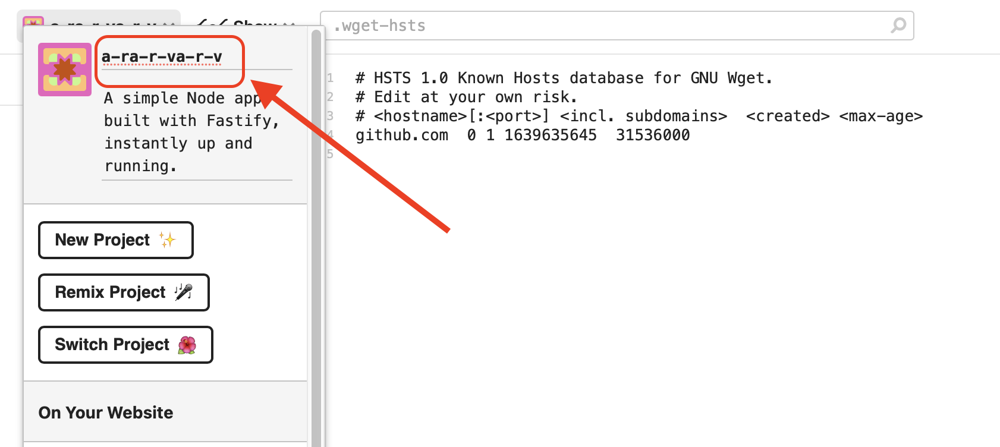

### 2. 生成UUID并填入代码中

  #### 2.1 前往地址: "https://www.uuidgenerator.net", 生成一个UUID

  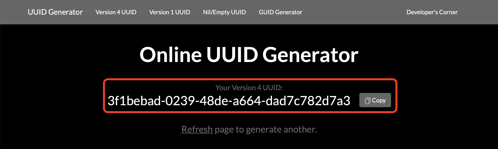

  #### 2.2 更改下图中箭头指示部分

  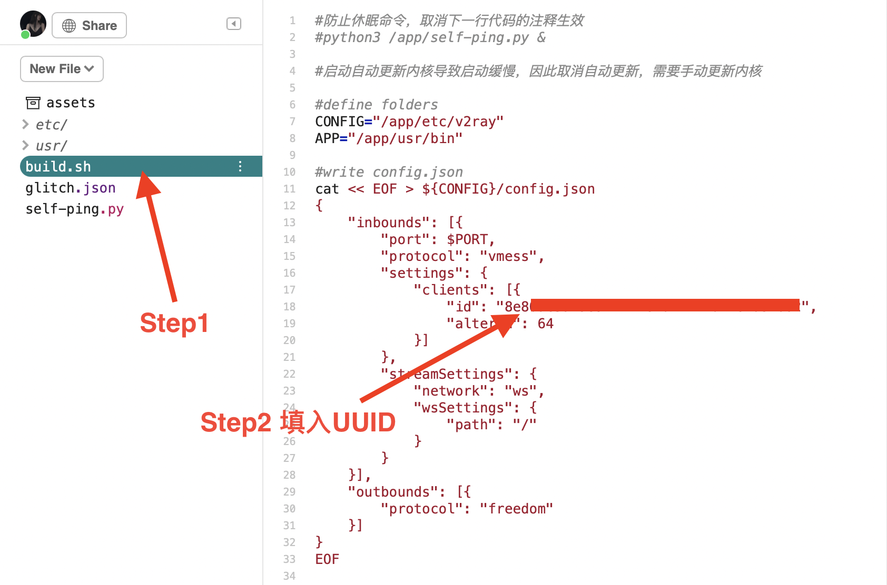

  #### 2.3 更改self-ping.py中的url部分，将xxx改为(1.)步骤中设置的应用名称
  
  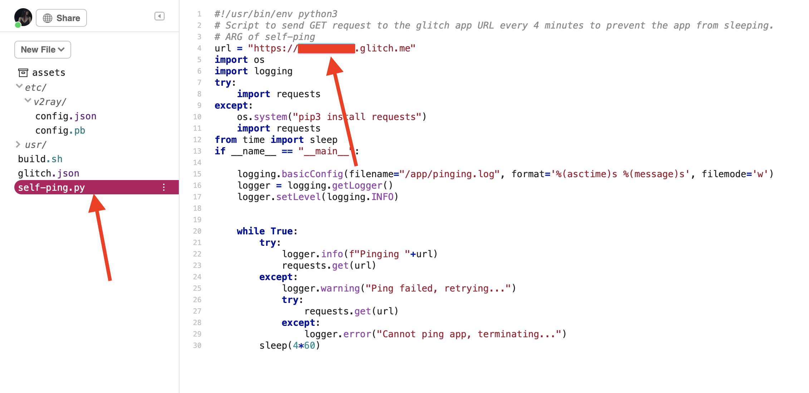

### 3.是否保持唤醒(建议关闭,浪费时长)

取消build.sh中第二行注释为保持唤醒

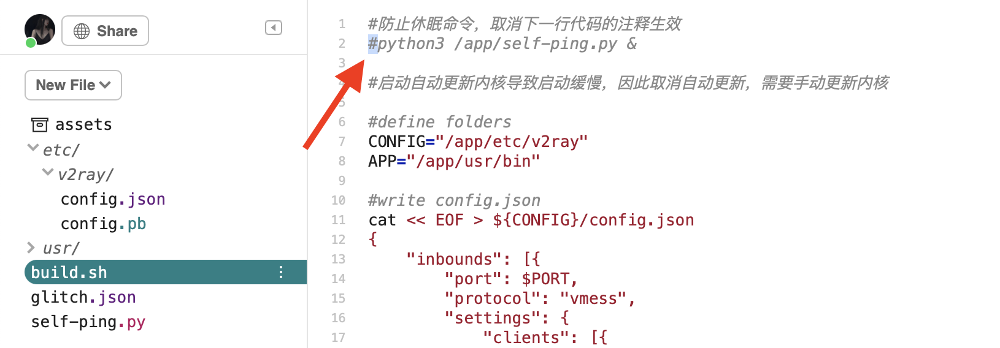

### 4.刷新

Tool -> Terminal -> 输入“refresh”回车

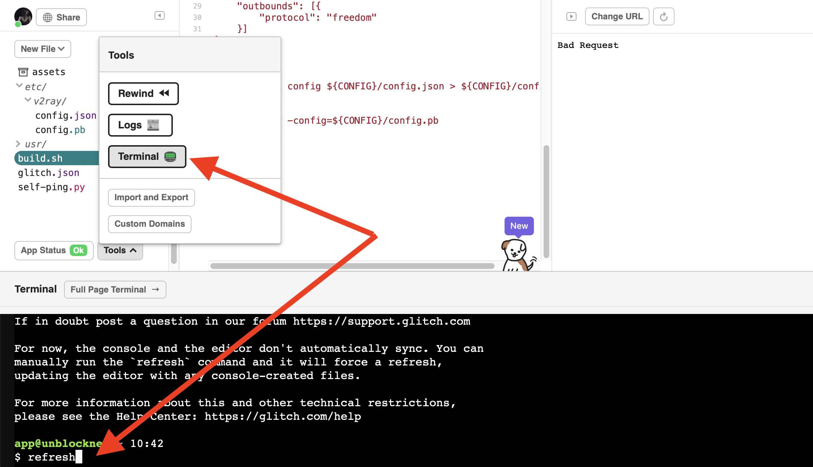

打开网址显示“Bad Request”表示部署成功

# 客户端配置

### 1.Shadowrocket

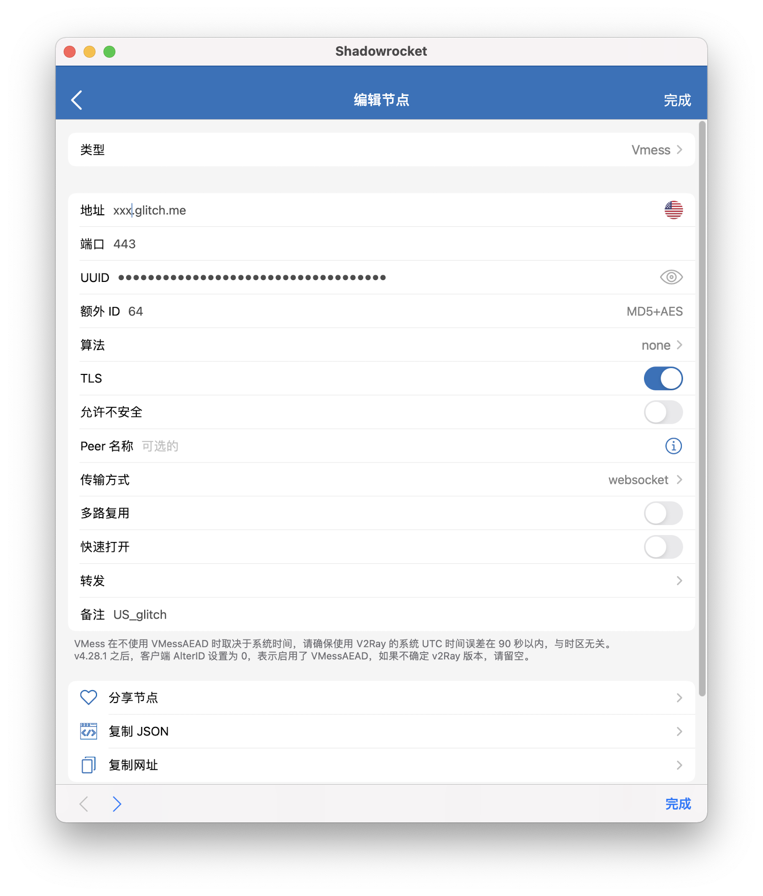

### 2.V2rayNG

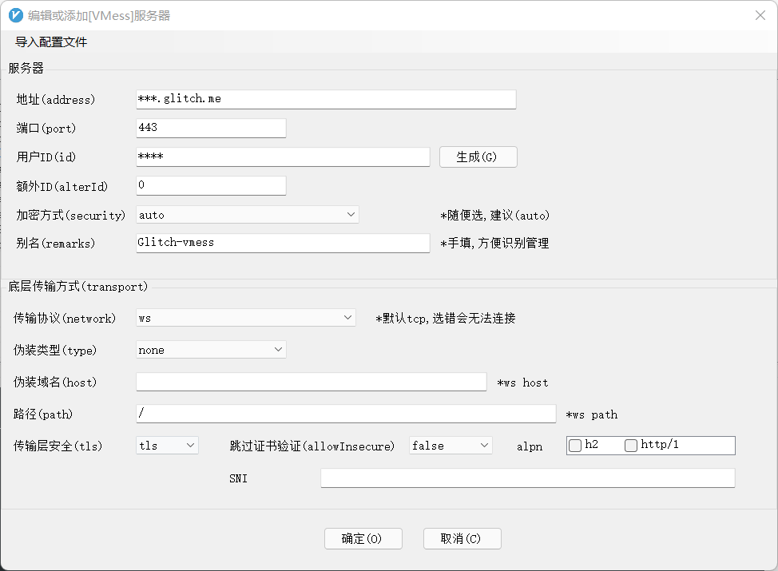

### 3.Clash

在proxies字段下填入以下内容，注意缩进

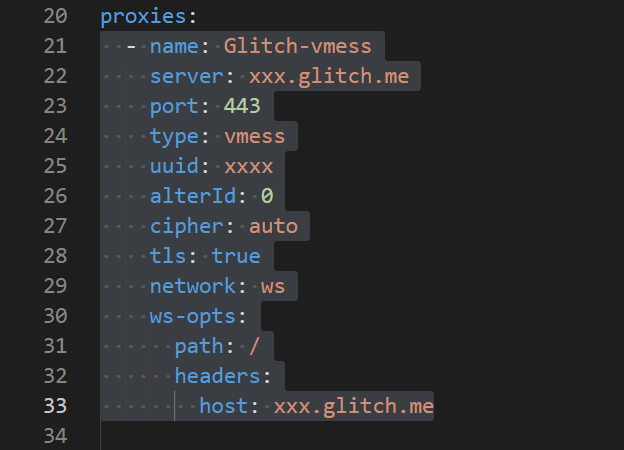

# Readme in English  

Official: https://glitch.com/  

How to Install: New Project -> Import form Github -> paste "https://github.com/ALLOC20/v2ray-glitch"

TODO...

# 特别感谢 ：

* [v2fly](https://github.com/v2fly/v2ray-core)
* [bclswl0827](https://github.com/bclswl0827/v2ray-heroku)
